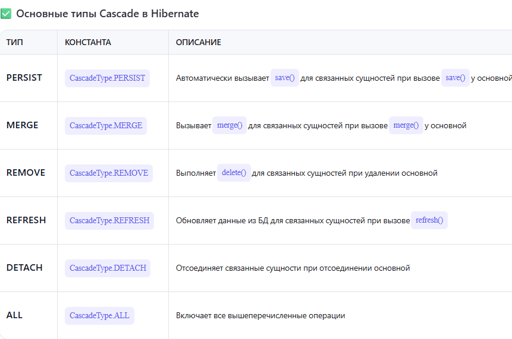

## Hiber2

[1. Что такое Hibernate?](#1-что-такое-hibernate)

[2. Что такое ORM?](#2-что-такое-orm)

[3. Какие преимущества использования Hibernate?](#3-какие-преимущества-использования-hibernate)

[4. Как Hibernate помогает в программировании?](#4-как-hibernate-помогает-в-программировании)

[5. Какие преимущества Hibernate над JDBC?](#5-какие-преимущества-hibernate-над-jdbc)

[6. Что такое конфигурационный файл Hibernate?](#6-что-такое-конфигурационный-файл-hibernate)

[7. Что такое Hibernate mapping file?](#7-что-такое-hibernate-mapping-file)

[8. Что такое Transient object?](#8-что-такое-transient-object)

[9. Что такое Persistent object?](#9-что-такое-persistent-object)

[10. Что такое TransactionFactory?](#10-что-такое-transactionfactory)

[11. Что такое ConnectionProvide?](#11-что-такое-connectionprovide)

[12. Что такое транзакция?](#12-что-такое-транзакция)

[13. Какие существуют стратегии загрузки обьектов в Hibernate?](#13-какие-существуют-стратегии-загрузки-обьектов-в-hibernate)

[14. Какие бывают ID generator-классы в Hibernate?](#14-какие-бывают-id-generator-классы-в-hibernate)

[15. Какие ключевые интерфейсы использует Hibernate?](#15-какие-ключевые-интерфейсы-использует-hibernate)

[16. Назвать некоторые важные аннотации в Hibernate?](#16-назвать-некоторые-важные-аннотации-в-hibernate)

[17. Какая роль интерфейса Session в Hibernate?](#17-какая-роль-интерфейса-session-в-hibernate)

[18. Какая роль интерфейса SessionFactory в Hibernate?](#18-какая-роль-интерфейса-sessionfactory-в-hibernate)

[19. В чем разница между OpenSession и GetCurrentSession?](#19-в-чем-разница-между-opensession-и-getcurrentsession)

[20. Какие типы коллекций представленны в Hibernate?](#20-какие-типы-коллекций-представленны-в-hibernate)

[21. Какие типы кеша есть в Hibernate?](#21-какие-типы-кеша-есть-в-hibernate)

[22. Типы стратегий кеша в Hibernate?](#22-типы-стратегий-кеша-в-hibernate)

[23. Состояния Entity в Hibernate?](#23-состояния-entity-в-hibernate)

[24. Что такое HQL и его примммущества?](#24-что-такое-hql-и-его-примммущества)

[25. Как реализованы JOIN`ы в Hibernate?](#25-как-реализованы-joinы-в-hibernate)

[26. Можно ли использовать native-SQL запросы в Hibernate?](#26-можно-ли-использовать-native-sql-запросы-в-hibernate)

[27. Как управлять транзакциями с помощью Hibernate?](#27-как-управлять-транзакциями-с-помощью-hibernate)

[28. Что такое каскадные связи?](#28-что-такое-каскадные-связи)

[29. Какие есть каскадные связи?](#29-какие-есть-каскадные-связи)

[30. Как интегрировать Hibernate в Spring?](#30-как-интегрировать-hibernate-в-spring)

[31. Какие паттерны применяются в Hibernate?](#31-какие-паттерны-применяются-в-hibernate)

# 1. Что такое Hibernate?

Hibernate - фреймворк, который позволяет работать с базой данных как с обычными Java-объектами, без необходимости писать SQL-запросы вручную. Он сам генерирует SQL, выполняет его и маппит результаты в Java-объекты.

Основные возможности Hibernate:
+ ORM (Object Relational Mapping) : связывает Java-классы с таблицами в БД. 
+ Управление сессией и транзакциями : абстрагирует работу с JDBC. 
+ Кэширование : поддерживает first-level и second-level кэш. 
+ Поддержка различных БД : благодаря диалектам, легко меняется тип БД. 
+ Lazy loading : загрузка данных "по требованию", что помогает оптимизировать производительность. 
+ Аннотации и XML-конфигурации : можно описывать маппинги через аннотации (@Entity, @Id и др.) или XML.

[К оглавлению](#Hiber2)

# 2. Что такое ORM?

ORM — это прослойка между Java-объектами и SQL-таблицами. Вместо того чтобы писать SQL-запросы вручную и маппить результаты ResultSet в объекты, ORM делает это за тебя.

[К оглавлению](#Hiber2)

# 3. Какие преимущества использования Hibernate?

+ Hibernate сам генерирует SQL-запросы на основе Java-объектов и операций над ними. Не нужно вручную писать SELECT, INSERT, UPDATE, DELETE
+ Простое отображение Java-классов на таблицы БД с помощью аннотаций или XML. Удобная работа с объектами вместо работы с ResultSet и JDBC напрямую
+ Достаточно указать нужный диалект (dialect), и Hibernate адаптирует SQL под конкретную БД (PostgreSQL, MySQL, Oracle и др.)
+ Поддерживает first-level cache (на уровне Session) и second-level cache (на уровне SessionFactory). Это уменьшает количество обращений к БД и повышает производительность
+ Позволяет загружать связанные данные только при необходимости благодаря ленивой загрузки. Это помогает избежать лишних запросов и повысить эффективность работы с БД.
+ Hibernate предоставляет удобный API для работы с транзакциями, что упрощает работу с бизнес-логикой, требующей атомарности
+ Объектно-ориентированный язык запросов, похожий на SQL, но работающий с классами и их полями, а не с таблицами и колонками
+ Легко настраивать отношения: one-to-one, one-to-many, many-to-many и т.д. Hibernate сам заботится об управлении этих связей.
+ Hibernate может интегрироваться с пулами соединений (например, HikariCP, C3P0), что улучшает производительность.
+ Hibernate отлично работает с фреймворком Spring, особенно через Spring Data JPA. Это позволяет использовать репозитории, автоматически генерируемые методы и удобное управление транзакциями через аннотации (@Transactional).

[К оглавлению](#Hiber2)

# 4. Как Hibernate помогает в программировании?

`Hibernate избавляет от необходимости писать рутинный JDBC-код`: работа с Connection, Statement, ResultSet — всё это берет на себя фреймворк.

```java
Вместо:
        
try (Connection conn = dataSource.getConnection();
     PreparedStatement ps = conn.prepareStatement("SELECT * FROM users WHERE id = ?");
     ResultSet rs = ps.executeQuery()) {
    // маппинг данных вручную
} catch (SQLException e) { ... }

Ты просто пишешь:

User user = session.get(User.class, 1L);
```

`Hibernate предоставляет удобное API для управления транзакциями`. Можно начать, зафиксировать или откатить транзакцию несколькими строками кода:
```java
Transaction tx = session.beginTransaction();
session.save(user);
tx.commit();
```

`Поддерживает HQL (Hibernate Query Language)` HQL — это объектно-ориентированный язык запросов, похожий на SQL, но работает с Java-классами и их полями, а не с таблицами и колонками. Это делает запросы более читаемыми и типобезопасными.

```java
List<User> users = session.createQuery("FROM User WHERE age > :age", User.class)
                           .setParameter("age", 18)
                           .list();
```

`Hibernate позволяет легко описывать связи между сущностями`:

+ @OneToOne 
+ @OneToMany 
+ @ManyToOne 
+ @ManyToMany

Он сам заботится об управлении этих связей при сохранении, обновлении и загрузке данных.

`Hibernate позволяет загружать данные "по требованию", что особенно полезно при работе с большими структурами или коллекциями`. 
Например, можно не загружать все заказы пользователя сразу, а сделать это только при обращении к ним.

```java
@OneToMany(fetch = FetchType.LAZY, mappedBy = "user")
private List<Order> orders;
```

`Hibernate поддерживает`:

+ First-level cache (на уровне Session) — уменьшает повторные запросы к БД в рамках одной сессии. 
+ Second-level cache (на уровне SessionFactory) — кэширует данные между сессиями, что полезно для часто запрашиваемых данных.

`Hibernate является реализация JPA (Java Persistence API), поэтому отлично интегрируется с Spring.`

[К оглавлению](#Hiber2)

# 5. Какие преимущества Hibernate над JDBC?

`Hibernate сам маппит данные из таблиц в Java-объекты.`  В JDBC приходится вручную писать код для преобразования ResultSet в объекты.
 
`Hibernate берет на себя управление соединениями, транзакциями и обработкой исключений.`  В JDBC всё это нужно реализовывать вручную, что приводит к громоздкому и повторяющемуся коду.

`Hibernate позволяет загружать связанные сущности только по требованию (FetchType.LAZY).`  В JDBC ленивую загрузку нужно реализовывать самостоятельно или не использовать вовсе.

`Hibernate поддерживает жизненный цикл объектов (transient, persistent, detached).` Это позволяет легко управлять изменениями объектов и автоматически синхронизировать их с БД. В JDBC все изменения нужно синхронизировать вручную.

`Hibernate поддерживает First-level cache (на уровне Session). Second-level cache (на уровне SessionFactory)` Это помогает уменьшить количество обращений к базе данных. В JDBC кэширование нужно реализовывать самостоятельно.

`В Hibernate можно легко описать связи между сущностями через аннотации: @OneToOne @OneToMany @ManyToMany`  В JDBC такие связи нужно обрабатывать вручную, что увеличивает сложность кода.

`Hibernate предоставляет удобный API для работы с транзакциями.`  В JDBC нужно вручную вызывать setAutoCommit(false), commit() и rollback().

[К оглавлению](#Hiber2)

# 6. Что такое конфигурационный файл Hibernate?

В Hibernate конфигурационный файл — это основной файл, в котором указываются параметры подключения к базе данных и настройки самого фреймворка.

Конфигурационный файл используется для настройки Hibernate перед тем, как он начнёт взаимодействовать с базой данных. Обычно он называется:

`hibernate.cfg.xml (чаще всего используется) или hibernate.properties`

Этот файл загружается при создании SessionFactory, и на его основе настраивается вся работа Hibernate с БД.


[К оглавлению](#Hiber2)

# 7. Что такое Hibernate mapping file?

Hibernate mapping file — это XML-файл, в котором описывается связь между Java-классом и таблицей в базе данных. То есть он используется для определения маппинга (отображения) полей класса на колонки таблицы.

Это альтернатива аннотациям (@Entity, @Id и т.д.). В современных проектах чаще используются аннотации или Spring Data JPA


[К оглавлению](#Hiber2)

# 8. Что такое Transient object?

Это просто обычный Java-объект, созданный с помощью new, который ещё не был сохранён через Hibernate (session.save() или подобное). Он не имеет идентификатора (ID) и не связан ни с каким Session. Как только мы вызываем метод save(), объект переходит в состояние Persistent и становится частью контекста Persistence. 


[К оглавлению](#Hiber2)

# 9. Что такое Persistent object?

Persistent объект — это Java-объект, который находится под управлением Hibernate, имеет идентификатор и связан с конкретной записью в базе данных. Он создаётся после вызова метода save(), persist() или get(). Hibernate отслеживает все изменения в таком объекте и автоматически синхронизирует их с БД при коммите транзакции

Persistent объект существует только внутри открытого Session .
Как только Session закрывается, объект переходит в состояние Detached .
В состоянии Persistent можно управлять связанными сущностями, участвовать в транзакциях


[К оглавлению](#Hiber2)

# 10. Что такое TransactionFactory?

TransactionFactory — это интерфейс , который отвечает за создание транзакций (Transaction) в Hibernate.
Он является частью внутренней архитектуры Hibernate и определяет, как будут управляться транзакции: через JDBC напрямую или через JTA (Java Transaction API), например, в приложениях с несколькими ресурсами (например, несколько БД, JMS и т.д.).

#### Основные реализации TransactionFactory:
`JdbcTransactionFactory` Используется по умолчанию. Управляет транзакциями через локальные JDBC-транзакции. Подходит для простых приложений без контейнера транзакций.

`JtaTransactionFactory` Используется, когда нужно управлять глобальными транзакциями (X/Open XA).
Полезно в enterprise-приложениях, где транзакции затрагивают несколько ресурсов (например, две БД, очередь сообщений и т.д.).
Интегрируется с сервером приложений (например, WildFly, WebLogic).

[К оглавлению](#Hiber2)

# 11. Что такое ConnectionProvide?

ConnectionProvider в Hibernate — это интерфейс, который отвечает за предоставление и освобождение JDBC-соединений. Он позволяет Hibernate абстрагироваться от конкретного источника соединений: будь то простой DriverManager, пул соединений (например, HikariCP), или DataSource через JNDI. В моих проектах я использовал HikariCP как основной ConnectionProvider благодаря его высокой производительности и интеграции по умолчанию в Spring Boot


[К оглавлению](#Hiber2)
 
# 12. Что такое транзакция?

Транзакция — это единица работы с базой данных, которая обеспечивает выполнение операций по принципу ACID: атомарность, согласованность, изоляция и устойчивость. В Hibernate транзакции можно управлять вручную через интерфейс Transaction или с помощью аннотации @Transactional в Spring, что позволяет автоматически открывать и закрывать транзакции


[К оглавлению](#Hiber2)

# 13. Какие существуют стратегии загрузки обьектов в Hibernate?

В Hibernate есть две стратегии загрузки объектов: FetchType.LAZY и FetchType.EAGER. LAZY загружает связанные данные только по требованию, что полезно для оптимизации. EAGER загружает всё сразу — это удобно, если данные всегда нужны. Я обычно использую LAZY по умолчанию, особенно для коллекций, чтобы избежать лишних запросов к базе

Важно: используйте LAZY, если не уверены. По умолчанию во многих случаях используется LAZY (например, для @OneToMany и @ManyToMany), чтобы избежать N+1 проблем или перегрузки данных.

#### Что такое "N+1 проблема"?

Это ситуация, когда при загрузке списка сущностей с ленивой связью выполняется по одному запросу на каждую сущность. Например:

````java
List<User> users = session.createQuery("FROM User", User.class).list();

for (User user : users) {
    user.getOrders().size(); // Вызывает отдельный SQL-запрос на каждую итерацию
}
````

[К оглавлению](#Hiber2)

# 14. Какие бывают ID generator-классы в Hibernate?

Hibernate поддерживает несколько стратегий генерации ID: IDENTITY, SEQUENCE, TABLE и AUTO. GenerationType.IDENTITY используется с автоинкрементом в MySQL, SEQUENCE — с последовательностями в Oracle/PostgreSQL. Я чаще всего использую SEQUENCE, потому что она позволяет заранее получить ID перед вставкой и лучше работает с пакетной обработкой. AUTO удобен для тестов, но в реальных проектах я предпочитаю явно указывать стратегию

[К оглавлению](#Hiber2)

# 15. Какие ключевые интерфейсы использует Hibernate?

Hibernate использует несколько ключевых интерфейсов: SessionFactory — фабрика для создания Session, который служит основным интерфейсом для взаимодействия с БД. Transaction управляет транзакциями, Query — выполняет HQL-запросы. Также есть Criteria API для типобезопасных запросов. В Spring Boot часто используется EntityManager вместо Session, а транзакции управляются через аннотацию @Transactional


[К оглавлению](#Hiber2)

# 16. Назвать некоторые важные аннотации в Hibernate?

+ @Entity
Указывает, что класс является сущностью (entity).
+ @Table(name = "users")
  Указывает имя таблицы в БД, если оно отличается от имени класса.
+ @Id
  Помечает поле как первичный ключ .
+ @GeneratedValue(strategy = GenerationType.IDENTITY)
  Определяет стратегию генерации ID.
+ @Column(name = "username", nullable = false, length = 50, unique = true)
  Настройка колонки в таблице.
  Можно указать имя, ограничения, длину, уникальность и т.д.
+ @OneToOne, @OneToMany, @ManyToOne, @ManyToMany
  Определяют связи между сущностями.
+ @JoinColumn(name = "address_id")
  Указывает внешний ключ для связи.
+ @Transient
  Поле не сохраняется в БД.
+ @Temporal(TemporalType.DATE / TIME / TIMESTAMP)
  Используется для типов Date и Calendar.
+ @Enumerated(EnumType.STRING)
  Для сохранения enum-значений в БД.
+ @Lob
  Для хранения больших объектов (CLOB, BLOB).
+ @Embedded, @Embeddable
  Используются для вложенных объектов.

[К оглавлению](#Hiber2)

# 17. Какая роль интерфейса Session в Hibernate?


[К оглавлению](#Hiber2)

# 18. Какая роль интерфейса SessionFactory в Hibernate?

SessionFactory в Hibernate — это фабрика для создания Session. Она создаётся один раз за всё время работы приложения и содержит всю конфигурацию и метаданные о сущностях.


[К оглавлению](#Hiber2)

# 19. В чем разница между OpenSession и GetCurrentSession?

Разница между openSession() и getCurrentSession() в том, что openSession() всегда создаёт новую сессию и её нужно закрывать вручную, а getCurrentSession() возвращает текущую сессию, привязанную к транзакции, и она закрывается автоматически. Я использовал getCurrentSession() в проектах с транзакциями, где важно сохранять состояние сессии между вызовами

[К оглавлению](#Hiber2)

# 20. Какие типы коллекций представленны в Hibernate?

Hibernate поддерживает разные типы коллекций: List, Set, Map, Collection. Я чаще всего использую Set для @ManyToMany и @OneToMany, потому что он обеспечивает уникальность и хорошую производительность. Если нужен порядок — использую List с @OrderColumn. Также знаю, как работать с Map, когда нужно хранить данные по ключу. Для оптимизации использую @BatchSize и @OrderBy

[К оглавлению](#Hiber2)

# 21. Какие типы кеша есть в Hibernate?

Hibernate поддерживает два типа кэша: first-level и second-level. First-level кэш привязан к Session и автоматически кэширует объекты в рамках одной сессии. Он всегда включён. Second-level кэш общий для всех сессий и позволяет кэшировать данные между запросами. Я использовал first-level кэш по умолчанию, а second-level настраивал через EhCache в проектах с высокой нагрузкой для уменьшения числа обращений к базе

[К оглавлению](#Hiber2)
 
# 22. Типы стратегий кеша в Hibernate?

Hibernate поддерживает несколько стратегий кэширования: READ_ONLY — для неизменных данных, NONSTRICT_READ_WRITE — для редко обновляемых, READ_WRITE — для согласованных данных и TRANSACTIONAL — для полной поддержки транзакций. Я чаще всего использовал READ_WRITE для бизнес-объектов и READ_ONLY для справочников. Настройку выполнял через EhCache
в
[К оглавлению](#Hiber2)

# 23. Состояния Entity в Hibernate?


В Hibernate сущность может находиться в одном из четырёх состояний: Transient (новый, не сохранённый), Persistent (управляемый Hibernate, с ID), Detached (отсоединённый после закрытия Session) и Removed (помеченный на удаление). Я использовал эти концепции при работе с транзакциями, особенно при обновлении detached-объектов через merge() или update()

[К оглавлению](#Hiber2)

# 24. Что такое HQL и его примммущества?

HQL — это объектно-ориентированный язык запросов в Hibernate, который позволяет работать с Java-объектами вместо таблиц и колонок. Его основные преимущества — переносимость между СУБД, типобезопасность и интеграция с Hibernate. Я использовал HQL для выборки, обновления и фильтрации данных, особенно когда важна читаемость и поддерживаемость кода. Однако в случае сложных или высоконагруженных запросов я переходил на нативный SQL

[К оглавлению](#Hiber2)

# 25. Как реализованы JOIN`ы в Hibernate?

Hibernate поддерживает JOIN через HQL, Criteria API и нативные SQL-запросы. В HQL чаще всего используются INNER JOIN и LEFT JOIN, а также JOIN FETCH для избежания N+1 проблемы. В Criteria API можно использовать метод join() или fetch() для загрузки связанных данных. Я использовал JOIN FETCH при работе с коллекциями, чтобы эффективно загружать связанные сущности за один запрос

[К оглавлению](#Hiber2)

# 26. Можно ли использовать native-SQL запросы в Hibernate?

Да, в Hibernate можно использовать native SQL-запросы с помощью метода createSQLQuery(). Я использовал их в случаях, когда требовался полный контроль над SQL или нужно было использовать специфические возможности СУБД, например, оконные функции PostgreSQL. Однако я старался использовать их только тогда, когда HQL или Criteria API были недостаточны, так как native SQL снижает переносимость кода и лишает нас преимуществ ORM

[К оглавлению](#Hiber2)

# 27. Как управлять транзакциями с помощью Hibernate?


[К оглавлению](#Hiber2)

# 28. Что такое каскадные связи?

Каскадные связи в Hibernate позволяют автоматически выполнять операции (save, update, delete и т.д.) над связанными сущностями. Я использовал их, например, чтобы автоматически сохранять вложенные объекты при сохранении основной сущности. Чаще всего применял cascade = PERSIST или cascade = ALL, особенно при работе с отношениями один-ко-многим. Но важно понимать, что каскадирование может привести к неожидаемым удалениям, если использовать REMOVE без осторожности

[К оглавлению](#Hiber2)

# 29. Какие есть каскадные связи?




[К оглавлению](#Hiber2)

# 30. Как интегрировать Hibernate в Spring?

Hibernate интегрируется в Spring через JPA. В Spring Boot достаточно подключить зависимость spring-boot-starter-data-jpa, настроить подключение к БД в application.properties и создать сущности через аннотации @Entity. Работа с данными ведётся через интерфейсы-репозитории (JpaRepository), а транзакции управляются через @Transactional

[К оглавлению](#Hiber2)

# 31. Какие паттерны применяются в Hibernate?

Hibernate использует несколько ключевых паттернов проектирования. Например, Data Mapper — он отделяет бизнес-объекты от логики работы с БД. Unit of Work и Identity Map реализованы через Session — они отслеживают изменения и управляют жизненным циклом объектов. Также используется Proxy для lazy loading и Strategy для разных стратегий генерации ID.

Почему не стоит использовать FetchType.LAZY за пределами Session?

Потому что при попытке доступа к LAZY-полю после закрытия Session возникает LazyInitializationException .

[К оглавлению](#Hiber2)

