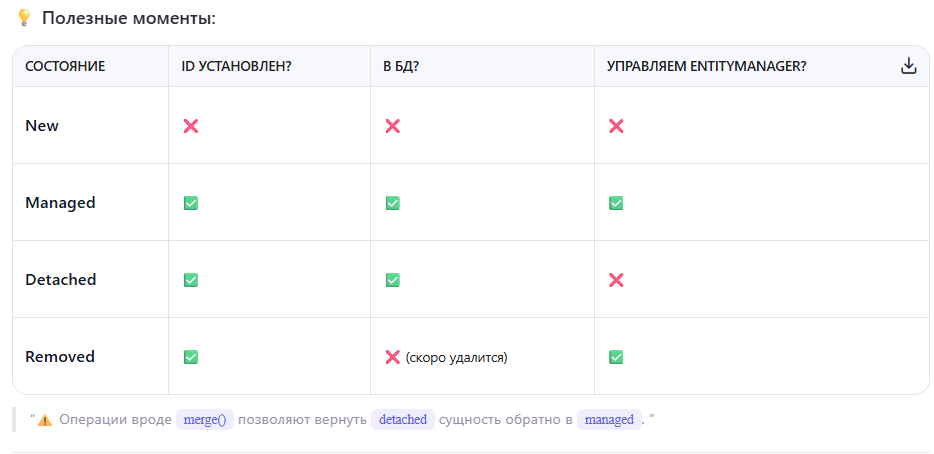
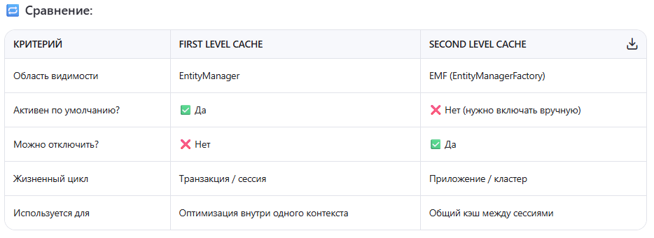

## JPA2

[1. Что такое JPA?](#1-что-такое-jpa)

[2. Из чего состоит JPA?](#2-из-чего-состоит-jpa)

[3. В чем отличия JPA от Hibernate?](#3-в-чем-отличия-jpa-от-hibernate)

[4. Можно ли использовать JPA с NoSQL?](#4-можно-ли-использовать-jpa-с-nosql)

[5. Что такое Entity?](#5-что-такое-entity)

[6. Какие требования JPA к Entity можете перечислить?](#6-какие-требования-jpa-к-entity-можете-перечислить)

[7. Типы связей между Entity?](#7-типы-связей-между-entity)

[8. Типы Fetch стратегий в JPA?](#8-типы-fetch-стратегий-в-jpa)

[9. Что такое EntityManager?](#9-что-такое-entitymanager)

[10. Какие 4 жизенных цикла Entity?](#10-какие-4-жизенных-цикла-entity)

[11. Два вида кеша в JPA?](#11-два-вида-кеша-в-jpa)

# 1. Что такое JPA?

JPA — это стандартная спецификация Java для объектно-реляционного отображения. Она предоставляет удобные инструменты для
работы с базами данных через объекты, используя такие понятия, как Entity, EntityManager и JPQL. Я активно использовал
JPA в проектах вместе с Hibernate — реализацией спецификации JPA, что позволило мне сосредоточиться на бизнес-логике, не
углубляясь в детали SQL.

[К оглавлению](#JPA2)

# 2. Из чего состоит JPA?

JPA состоит из нескольких ключевых частей: во-первых, это API с такими элементами, как EntityManager и
EntityTransaction, во-вторых, модели данных на основе сущностей, аннотированных с помощью таких меток, как @Entity и
@Id. Также важны Persistence Unit, где описываются параметры подключения, и Persistence Context, который отвечает за
управление жизненным циклом сущностей

[К оглавлению](#JPA2)

# 3. В чем отличия JPA от Hibernate?

JPA — это стандартная спецификация для ORM в Java, тогда как Hibernate — это её наиболее популярная реализация. То есть
JPA задаёт правила, а Hibernate их реализует.

[К оглавлению](#JPA2)

# 4. Можно ли использовать JPA с NoSQL?

Стандартный JPA изначально предназначен для работы с реляционными БД и не поддерживает NoSQL напрямую. Однако в
экосистеме Spring есть решения вроде Spring Data MongoDB или Spring Data Cassandra, где используется похожий стиль
разработки через репозитории и аннотации. Так что хотя мы не используем сам JPA, мы можем сохранить знакомый паттерн
работы с данными

[К оглавлению](#JPA2)

# 5. Что такое Entity?

Entity в JPA — это Java-класс, представляющий собой таблицу в базе данных. Он аннотируется как @Entity, имеет
идентификатор (@Id) и может содержать поля, связанные с колонками таблицы через @Column. Сущности управляются через
EntityManager, что позволяет работать с ними как с объектами, не используя SQL напрямую.

[К оглавлению](#JPA2)

# 6. Какие требования JPA к Entity можете перечислить?

Сущность в JPA должна быть обычным Java-классом (POJO), иметь конструктор без аргументов, быть аннотированной как
@Entity, и содержать поле с @Id. Также важно правильно маппить поля в таблицу через @Column, а при необходимости —
использовать связи между сущностями. Такой подход обеспечивает стабильную работу с базой данных через EntityManager

[К оглавлению](#JPA2)

# 7. Типы связей между Entity?

+ @OneToOne — один к одному. Каждый экземпляр одной сущности связан ровно с одним экземпляром другой сущности и
  наоборот.

```java
@Entity
public class User {
    @Id
    private Long id;

    @OneToOne(cascade = CascadeType.ALL)
    @JoinColumn(name = "address_id", referencedColumnName = "id")
    private Address address;
}

@JoinColumn указывает, по какой колонке происходит связь.
referencedColumnName указывает, на какую колонку ссылается (по умолчанию — на id).
```

+ @OneToMany / @ManyToOne — один ко многим / многие к одному. Это пара связей, которые вместе описывают отношение «один ко многим».
```java
@Entity
public class Department {
    @Id
    private Long id;

    @OneToMany(mappedBy = "department", fetch = FetchType.LAZY)
    private List<Employee> employees;
}

@Entity
public class Employee {
    @Id
    private Long id;

    @ManyToOne
    @JoinColumn(name = "department_id")
    private Department department;
}
mappedBy указывает на поле в обратной сущности, которое управляет связью.
fetch = FetchType.LAZY — загрузка при необходимости (по умолчанию для @OneToMany).
fetch = FetchType.EAGER — загрузка сразу (по умолчанию для @ManyToOne).
```
+ @ManyToMany — многие ко многим. Каждый экземпляр одной сущности может быть связан со многими экземплярами другой сущности и наоборот.
```java
@Entity
public class Student {
    @Id
    private Long id;

    @ManyToMany
    @JoinTable(
        name = "student_course",
        joinColumns = @JoinColumn(name = "student_id"),
        inverseJoinColumns = @JoinColumn(name = "course_id"))
    private List<Course> courses;
}
Используется промежуточная таблица (student_course), которая хранит пары ID.
joinColumns — колонки текущей сущности.
inverseJoinColumns — колонки другой сущности.
```

- @OneToOne. Fetchtype по умолчанию - EAGER. Когда связь уникальна и обязательна 
- @OneToMany. Fetchtype по умолчанию - LAZY. Когда одна сущность имеет несколько связанных
- @ManyToOne. Fetchtype по умолчанию - EAGER. Обратная сторона @OneToMany
- @ManyToMany. Fetchtype по умолчанию - LAZY. Когда нужна гибкая связь много-ко-многим

[К оглавлению](#JPA2)

# 8. Типы Fetch стратегий в JPA?

+ FetchType.EAGER — немедленная загрузка

Связанная сущность загружается сразу, вместе с основной. Используется по умолчанию для @ManyToOne и @OneToOne.

#### Когда использовать:
Если вы всегда или почти всегда используете связанную сущность.
Для небольших и часто используемых объектов.

+ FetchType.LAZY — отложенная загрузка
  
Связанная сущность загружается только при первом обращении к ней (ленивая загрузка). Используется по умолчанию для @OneToMany и @ManyToMany.
#### Когда использовать:
Если связанная сущность используется не всегда.
Чтобы избежать лишних запросов к БД.
#### Как работает Lazy-загрузка?
Когда вы объявляете поле как LAZY, JPA создаёт прокси-объект вместо реальной сущности. При первом обращении к этому объекту выполняется дополнительный запрос к БД.

+ По возможности используйте LAZY, чтобы избежать лишней нагрузки на БД. 
+ Используйте JOIN FETCH в JPQL или методы @EntityGraph, чтобы загружать LAZY-поля в рамках одного запроса. 
+ Убедитесь, что доступ к LAZY-связям происходит внутри открытой транзакции.

[К оглавлению](#JPA2)

# 9. Что такое EntityManager?

EntityManager — это интерфейс, предоставляемый JPA, для управления сущностями и выполнения операций с базой данных. Он отвечает за:

- Создание новых сущностей (persist)
- Поиск сущностей по ID (find)
- Обновление сущностей (merge)
- Удаление сущностей (remove)
- Выполнение JPQL-запросов 
- Управление транзакциями (вместе с EntityTransaction)

Основные методы EntityManager:

- T find(Class<T> entityClass, Object primaryKey) - Находит сущность по её ID. Если не найдена — возвращает null
- void persist(Object entity) - Сохраняет новую сущность в БД (переводит её в состояние - управляемый).
- T merge(T entity) - Обновляет существующую сущность или сохраняет, если она ещё не была сохранена. Возвращает управляемую сущность 
- void remove(Object entity) - Удаляет сущность из БД.
- T getReference(Class<T> entityClass, Object primaryKey) - Получает прокси-объект (ленивая загрузка). Полезно, когда нужно просто сослаться на сущность без полной загрузки.
- Query createQuery(String qlString) - Создаёт JPQL-запрос
- Query createNativeQuery(String sqlString) - Создаёт нативный SQL-запрос

[К оглавлению](#JPA2)

# 10. Какие 4 жизенных цикла Entity?

+ New (Transient) — Новый (не сохранённый)

Это обычный Java-объект, который ещё не связан с базой данных.
У него нет идентификатора (id) или он равен null.
Такая сущность не управляется EntityManager.

+ Managed (Persistent) — Управляемый
  
Объект находится внутри Persistence Context и управляется EntityManager.
Он сохранён в БД, имеет ID и отслеживается JPA.
Любые изменения в этом объекте автоматически синхронизируются с БД при коммите транзакции. 

#### Как попасть в это состояние:
Вызовом entityManager.persist(user) для new сущности, или через find(), getSingleResult() и другие методы поиска

+ Detached — Отсоединённый
  
Объект был ранее управляемым , но больше не находится в Persistence Context.

Это может произойти:
+ После завершения транзакции 
+ После вызова entityManager.detach(user)
+ При явном закрытии EntityManager
  
Состояние можно снова сделать управляемым через merge().

+ Removed — Удалённый
  
Сущность помечена как удалённая из Persistence Context. Физическое удаление из БД происходит при коммите транзакции.
До этого момента она всё ещё считается частью контекста.

#### Как попасть в это состояние:
`entityManager.remove(user); // состояние: Removed`



[К оглавлению](#JPA2)

# 11. Два вида кеша в JPA?

+ First Level Cache (Кэш первого уровня)

Это встроенный кэш, который привязан к EntityManager.
Он всегда активен и не может быть отключен.
Хранит данные в рамках одной транзакции или Persistence Context.

#### Как работает:
+ При первом вызове find() или JPQL-запроса сущность загружается из БД и сохраняется в First Level Cache. 
+ При повторном запросе этой же сущности по ID — она берётся из кэша, а не из БД.

```java
User user1 = entityManager.find(User.class, 1L); // Загрузка из БД
User user2 = entityManager.find(User.class, 1L); // Из кэша первого уровня
```

+ Second Level Cache (Кэш второго уровня)
  
Это необязательный кэш, общий для всех EntityManager'ов и транзакций.
Управление этим кэшем осуществляется через провайдера (например, Hibernate).
Хранится между разными сессиями и транзакциями, может быть распределённым.

#### Когда используется:
+ Чтобы уменьшить количество обращений к БД между разными пользователями/сессиями. 
+ Для часто читаемых, но редко изменяемых данных (справочники, настройки и т.д.).
  
#### Как включить:
+ Добавить зависимость для реализации кэша (например, Ehcache, Hazelcast). 
+ Настроить persistence.xml или application.properties. 
+ Аннотировать Entity как кэшируемую:

```java
@Entity
@Cacheable
@org.hibernate.annotations.Cache(usage = CacheConcurrencyStrategy.READ_WRITE)
public class User {
    ...
}
```

#### Пример

```java
// Первая сессия
User user1 = entityManager.find(User.class, 1L); // Загрузка из БД и запись в L2 cache

entityManager.close();

// Вторая сессия
User user2 = anotherEntityManager.find(User.class, 1L); // Забирается из Second Level Cache
```



[К оглавлению](#JPA2)
