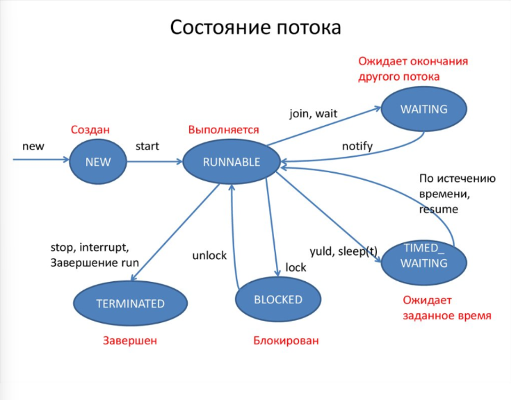

## Multithreading

[1. Что такое поток в контексте Java?](#1-что-такое-поток-в-контексте-java)

[2. Как создать поток в Java?](#2-как-создать-поток-в-java)

[3. Чем отличается метод run() от метода start() в контексте потоков?](#3-чем-отличается-метод-run-от-метода-start-в-контексте-потоков)

[4. В чем разница между конкуренцией и параллелизмом?](#4-в-чем-разница-между-конкуренцией-и-параллелизмом)

[5. Как принудительно запустить поток?](#5-как-принудительно-запустить-поток)

[6. Что такое монитор?](#6-что-такое-монитор)

[7. Что такое потоки демоны?](#7-что-такое-потоки-демоны)

[8. Как работает механизм синхронизации потоков в Java?](#8-как-работает-механизм-синхронизации-потоков-в-java)

[9. Что такое взаимная блокировка (deadlock) и как ее избежать?](#9-что-такое-взаимная-блокировка-deadlock-и-как-ее-избежать)

[10. Какие преимущества и недостатки использования ExecutorService для управления потоками??](#10-какие-преимущества-и-недостатки-использования-executorservice-для-управления-потоками)

[11. Какие стратегии и подходы используются для оптимизации производительности при работе с потоками?](#11-какие-стратегии-и-подходы-используются-для-оптимизации-производительности-при-работе-с-потоками)

[12. Какие особенности и преимущества ForkJoinPool по сравнению с обычными потоками?](#12-какие-особенности-и-преимущества-forkjoinpool-по-сравнению-с-обычными-потоками)

[13. Как можно реализовать механизм ожидания завершения нескольких потоков?](#13-как-можно-реализовать-механизм-ожидания-завершения-нескольких-потоков)

[14. Какой класс в Java используется для создания нового потока?](#14-какой-класс-в-java-используется-для-создания-нового-потока)

[15. Каким образом можно создать поток, используя интерфейс Runnable?](#15-каким-образом-можно-создать-поток-используя-интерфейс-runnable)

[16. Чем отличается создание потока с использованием класса Thread от создания с использованием интерфейса Runnable?](#16-чем-отличается-создание-потока-с-использованием-класса-thread-от-создания-с-использованием-интерфейса-runnable)

[17. Как можно создать поток, используя лямбда-выражения?](#17-как-можно-создать-поток-используя-лямбда-выражения)

[18. В чем преимущество использования интерфейса Callable по сравнению с Runnable при создании потоков?](#18-в-чем-преимущество-использования-интерфейса-callable-по-сравнению-с-runnable-при-создании-потоков)

[19. Как использовать пул потоков для управления множеством потоков в Java?](#19-как-использовать-пул-потоков-для-управления-множеством-потоков-в-java)

[20. Как реализовать паттерн Producer-Consumer с использованием многопоточности в Java?](#20-как-реализовать-паттерн-producer-consumer-с-использованием-многопоточности-в-java)

[21. Какие механизмы синхронизации потоков можно использовать при реализации многопоточных приложений?](#21-какие-механизмы-синхронизации-потоков-можно-использовать-при-реализации-многопоточных-приложений)

[22. Какие существуют способы управления состоянием потоков в Java и как они влияют на производительность приложения?](#22-какие-существуют-способы-управления-состоянием-потоков-в-java-и-как-они-влияют-на-производительность-приложения)

[23. Какие основные состояния потоков в Java?](#23-какие-основные-состояния-потоков-в-java)

[24. Как создать новый поток в Java?](#24-как-создать-новый-поток-в-java)

[25. Что такое метод join() в контексте потоков и для чего он используется?](#25-что-такое-метод-join-в-контексте-потоков-и-для-чего-он-используется)

[26. Чем отличаются Runnable и Callable?](#26-чем-отличаются-runnable-и-callable)

[27. Какие методы используются для приостановки и возобновления работы потока?](#27-какие-методы-используются-для-приостановки-и-возобновления-работы-потока)

[28. Чем отличается метод sleep() от wait()?](#28-чем-отличается-метод-sleep-от-wait)

[29. Как работает метод interrupt() и в каких случаях он используется?](#29-как-работает-метод-interrupt-и-в-каких-случаях-он-используется)

[30. Как реализовать безопасное взаимодействие между потоками при использовании общих ресурсов?](#30-как-реализовать-безопасное-взаимодействие-между-потоками-при-использовании-общих-ресурсов)

[31. Какие стратегии можно использовать для управления состоянием потоков в многопоточной среде?](#31-какие-стратегии-можно-использовать-для-управления-состоянием-потоков-в-многопоточной-среде)

[32. Каким образом можно реализовать паттерн «один производитель - много потребителей» в многопоточной программе на Java?](#32-каким-образом-можно-реализовать-паттерн-один-производитель---много-потребителей-в-многопоточной-программе-на-java)

[33. Что такое valotile?](#33-что-такое-valotile)

[34. Какой интерфейс из пакета java.util.concurrent представляет собой фреймворк, который упрощает выполнение асинхронных задач?](#34-какой-интерфейс-из-пакета-javautilconcurrent-представляет-собой-фреймворк-который-упрощает-выполнение-асинхронных-задач)

[35. В чем основное преимущество использования классов из пакета java.util.concurrent по сравнению с традиционным способом работы с потоками в Java?](#35-в-чем-основное-преимущество-использования-классов-из-пакета-javautilconcurrent-по-сравнению-с-традиционным-способом-работы-с-потоками-в-java)

[36. Какой класс из пакета java.util.concurrent используется для блокировок, которые позволяют более гибкое управление, чем синхронизированные блоки или методы?](#36-какой-класс-из-пакета-javautilconcurrent-используется-для-блокировок-которые-позволяют-более-гибкое-управление-чем-синхронизированные-блоки-или-методы)

[37. Какой класс из пакета java.util.concurrent позволяет выполнить задачу в пуле потоков и вернуть результат в будущем?](#37-какой-класс-из-пакета-javautilconcurrent-позволяет-выполнить-задачу-в-пуле-потоков-и-вернуть-результат-в-будущем)

[38. Как работает ConcurrentHashMap и в чем его основное отличие от Hashtable и synchronizedMap?](#38-как-работает-concurrenthashmap-и-в-чем-его-основное-отличие-от-hashtable-и-synchronizedmap)

[39. Что такое CyclicBarrier и в каких сценариях его использование наиболее целесообразно?](#39-что-такое-cyclicbarrier-и-в-каких-сценариях-его-использование-наиболее-целесообразно)

[40. Как работает CopyOnWriteArrayList?](#40-как-работает-copyonwritearraylist)

[41. Какие есть виды ThreadPool?](#41-какие-есть-виды-threadpool)

[42. Что такое Atomic?](#42-что-такое-atomic)

[43. Какие есть виды Atomic?](#43-какие-есть-виды-atomic)

[44. За счет какого алгоритма работают Atomic?](#44-за-счет-какого-алгоритма-работают-atomic)

[45. Что такое ThreadPool?](#45-что-такое-threadpool)

[46. Как можно использовать BlockingQueue для реализации асинхронного очередного доступа к ресурсам?](#46-как-можно-использовать-blockingqueue-для-реализации-асинхронного-очередного-доступа-к-ресурсам)

[47. Какие особенности и преимущества ScheduledExecutorService по сравнению с обычными ExecutorService?](#47-какие-особенности-и-преимущества-scheduledexecutorservice-по-сравнению-с-обычными-executorservice)

[48. В чем заключается принцип работы класса Phaser и как его функциональность может быть использована для координации фаз выполнения многопоточных задач?](#48-в-чем-заключается-принцип-работы-класса-phaser-и-как-его-функциональность-может-быть-использована-для-координации-фаз-выполнения-многопоточных-задач)

[49. В чем разница между CyclicBarrier и CountDownLatch?](#49-в-чем-разница-между-cyclicbarrier-и-countdownlatch)

[50. Что такое ThreadLocal?](#50-что-такое-threadlocal)

[51. Что такое Semaphore?](#51-что-такое-semaphore)

[52. Что такое состояние гонки и как оно может возникнуть в многопоточной программе?](#52-что-такое-состояние-гонки-и-как-оно-может-возникнуть-в-многопоточной-программе)

[53. Какие основные способы синхронизации потоков вы знаете в Java?](#53-какие-основные-способы-синхронизации-потоков-вы-знаете-в-java)

[54. Как работает ключевое слово synchronized в Java?](#54-как-работает-ключевое-слово-synchronized-в-java)

[55. Какие есть проблемы многопоточности java?](#55-какие-есть-проблемы-многопоточности-java)

[56. Что такое потокобезопасность?](#56-что-такое-потокобезопасность)

[57. Что такое мертвая блокировка (deadlock) и какие условия необходимы для ее возникновения?](#57-что-такое-мертвая-блокировка-deadlock-и-какие-условия-необходимы-для-ее-возникновения)

[58. Как обнаружить и избежать проблему livelock в многопоточных приложениях?](#58-как-обнаружить-и-избежать-проблему-livelock-в-многопоточных-приложениях)

[59. Какие инструменты мониторинга потоков существуют в Java, и как они используются?](#59-какие-инструменты-мониторинга-потоков-существуют-в-java-и-как-они-используются)

[60. Как использовать ReentrantLock и как он отличается от использования synchronized блоков или методов?](#60-как-использовать-reentrantlock-и-как-он-отличается-от-использования-synchronized-блоков-или-методов)

[61. Опишите, как работает и для чего используется Condition интерфейс в современном многопоточном программировании.](#61-опишите-как-работает-и-для-чего-используется-condition-интерфейс-в-современном-многопоточном-программировании)

[62. Какие стратегии вы бы использовали для оптимизации работы с многопоточностью в высоконагруженной системе?](#62-какие-стратегии-вы-бы-использовали-для-оптимизации-работы-с-многопоточностью-в-высоконагруженной-системе)

[63. Что такое потокобезопасный Singleton?](#63-что-такое-потокобезопасный-singleton)

[64. Способы реализации потогобезопасного Singleton?](#64-способы-реализации-потогобезопасного-singleton)

[65. Что такое CAS в контексте многопоточного программирования?](#65-что-такое-cas-в-контексте-многопоточного-программирования)

[66. Какие проблемы решает механизм CAS?](#66-какие-проблемы-решает-механизм-cas)

[67. Дайте определение аббревиатуре CAS.](#67-дайте-определение-аббревиатуре-cas)

[68. Как реализуется механизм CAS в Java? Приведите пример.](#68-как-реализуется-механизм-cas-в-java-приведите-пример)

[69. В чем преимущество использования CAS по сравнению с блокировками в многопоточном программировании?](#69-в-чем-преимущество-использования-cas-по-сравнению-с-блокировками-в-многопоточном-программировании)

[70. Какие операции поддерживает интерфейс Atomic в Java и как они связаны с CAS?](#70-какие-операции-поддерживает-интерфейс-atomic-в-java-и-как-они-связаны-с-cas)

[71. Какие проблемы могут возникнуть при использовании CAS и как их можно решить?](#71-какие-проблемы-могут-возникнуть-при-использовании-cas-и-как-их-можно-решить)

[72. Какие проблемы могут возникнуть при использовании CAS и как их можно решить?](#72-объясните-как-работает-механизм-оптимистичной-блокировки-на-основе-cas-и-в-каких-случаях-он-предпочтителен)

[73. Как влияет на производительность системы чрезмерное использование CAS, и какие меры можно предпринять для ее оптимизации?](#73-как-влияет-на-производительность-системы-чрезмерное-использование-cas-и-какие-меры-можно-предпринять-для-ее-оптимизации)


# 1. Что такое поток в контексте Java?

Поток (thread) — это независимая последовательность выполнения инструкций в рамках одной программы. Потоки позволяют выполнять несколько задач одновременно, используя возможности многоядерных процессоров.

[К оглавлению](#Multithreading)

# 2. Как создать поток в Java?

- Наследование от Thread — создание потока путем создания нового класса. 

```java
class MyThread extends Thread {
    @Override
    public void run() {
        System.out.println("Поток выполняется");
    }

    public static void main(String[] args) {
        MyThread thread = new MyThread();  // Создаем объект потока
        thread.start();  // Запускаем поток
    }
}
```

- Реализация интерфейса Runnable — более гибкий способ, который не ограничивает наследование. 

```java
class MyRunnable implements Runnable {
    @Override
    public void run() {
        System.out.println("Поток выполняется через Runnable");
    }

    public static void main(String[] args) {
        MyRunnable myRunnable = new MyRunnable();  // Создаем объект Runnable
        Thread thread = new Thread(myRunnable);    // Создаем поток и передаем Runnable
        thread.start();  // Запускаем поток
    }
}
```

- Использование ExecutorService — для удобного управления пулом потоков. 

```java
import java.util.concurrent.ExecutorService;
import java.util.concurrent.Executors;

public class ExecutorServiceExample {
    public static void main(String[] args) {
        ExecutorService executorService = Executors.newFixedThreadPool(2);  // Пул из 2 потоков
        executorService.submit(() -> System.out.println("Задача 1"));
        executorService.submit(() -> System.out.println("Задача 2"));
        executorService.shutdown();  // Завершаем работу пула потоков
    }
}
```

- Использование лямбда-выражений — для простоты и лаконичности кода. 

```java
public class LambdaThreadExample {
    public static void main(String[] args) {
        Runnable task = () -> System.out.println("Поток выполняется через лямбда-выражение");
        Thread thread = new Thread(task);  // Создаем поток с лямбда-выражением
        thread.start();  // Запускаем поток
    }
}
```

- Использование ForkJoinPool — для параллельных вычислений.

```java
import java.util.concurrent.*;

public class ForkJoinPoolExample {
    public static void main(String[] args) {
        ForkJoinPool forkJoinPool = new ForkJoinPool();  // Создаем пул ForkJoin
        forkJoinPool.submit(() -> {
            System.out.println("Поток в ForkJoinPool выполняется");
        }).join();  // Запускаем задачу
    }
}
```

[К оглавлению](#Multithreading)

# 3. Чем отличается метод run() от метода start() в контексте потоков?

Метод run() — это метод, который содержит код для выполнения потока. Если вызвать его напрямую, код будет выполнен в текущем потоке, а не в новом. Метод start() запускает новый поток, и в этом потоке будет выполнен код из метода run().

[К оглавлению](#Multithreading)

# 4. В чем разница между конкуренцией и параллелизмом?

Конкуренция — это возможность выполнения нескольких задач, которые могут разделять ресурсы, и управление доступом к этим ресурсам. Это не обязательно означает выполнение задач одновременно. Параллелизм же — это реальное выполнение задач одновременно на разных процессорах или ядрах, что позволяет ускорить обработку.

[К оглавлению](#Multithreading)

# 5. Как принудительно запустить поток?

В Java потоки запускаются с помощью метода start(), и принудительно запустить поток не представляется возможным в традиционном смысле. Однако, если вам нужно принудительно управлять моментом начала выполнения, вы можете использовать синхронизацию (например, wait()/notify()) или инструменты для управления пулом потоков, такие как ExecutorService. Однако принудительное выполнение потока в момент его создания в Java невозможно, поскольку управление планированием и распределением процессорного времени остается на усмотрение операционной системы и JVM.

[К оглавлению](#Multithreading)

# 6. Что такое монитор?

Монитор — это механизм синхронизации в Java, который предотвращает одновременный доступ к общим данным несколькими потоками. Каждый объект имеет свой монитор, и поток должен захватить его перед тем, как выполнить синхронизированный код. Для этого используется ключевое слово synchronized.

[К оглавлению](#Multithreading)

# 7. Что такое потоки демоны?

Потоки-демоны — это потоки, которые не препятствуют завершению программы. Они выполняются в фоновом режиме, и если все основные потоки завершены, программа завершится, даже если потоки-демоны продолжают работать. Потоки-демоны полезны для фоновых задач, которые не требуют завершения перед выходом из программы.

[К оглавлению](#Multithreading)

# 8. Как работает механизм синхронизации потоков в Java?

Механизм синхронизации потоков в Java используется для управления доступом нескольких потоков к общим ресурсам, чтобы
избежать проблем гонки потоков и обеспечивать корректную работу многозадачных приложений. Основные механизмы
синхронизации включают ключевое слово synchronized, блокировки Lock, коллекции из java.util.concurrent и другие подходы(
Например Семафоры. Использование volatile). Для эффективной синхронизации важно правильно использовать эти инструменты,
избегать deadlock и других синхронизационных проблем.

[К оглавлению](#Multithreading)

# 9. Что такое взаимная блокировка (deadlock) и как ее избежать?

Взаимная блокировка (deadlock) — это состояние, когда два или более потока не могут продолжить выполнение, ожидая освобождения ресурсов, которые заблокированы друг другом. Чтобы избежать deadlock, следует:

- Использовать строгий порядок захвата ресурсов. 

```java
class Resource {
    public synchronized void lockA(Resource other) throws InterruptedException {
        other.lockA(this);  // Поток всегда захватывает ресурсы в том же порядке
    }

    public synchronized void lockB(Resource other) throws InterruptedException {
        other.lockB(this);  // Поток всегда захватывает ресурсы в том же порядке
    }
}
```

- Применять тайм-ауты для захвата блокировок. 

```java
class Resource {
    private final Lock lock = new ReentrantLock();

    public void lockA() throws InterruptedException {
        if (lock.tryLock(1000, TimeUnit.MILLISECONDS)) {
            // Успешно захвачен ресурс
        } else {
            // Время ожидания вышло
        }
    }
}
```

- Минимизировать количество удерживаемых блокировок. 
- Использовать более высокоуровневые механизмы синхронизации. (ExecutorService, Semaphore, CountDownLatch, CyclicBarrier и т.д.)
- Применять tryLock для попытки захвата ресурсов.

```java
Lock lockA = new ReentrantLock();
Lock lockB = new ReentrantLock();

if (lockA.tryLock() && lockB.tryLock()) {
    try {
        // Выполнение работы с ресурсами
    } finally {
        lockA.unlock();
        lockB.unlock();
    }
} else {
    // Если не удалось захватить оба ресурса, попытаться снова или завершить
}
```

[К оглавлению](#Multithreading)

# 10. Какие преимущества и недостатки использования ExecutorService для управления потоками??

`Преимущества`:

- Управление жизненным циклом потоков.
- Эффективное использование пула потоков. 
- Упрощение обработки многозадачности и исключений. 
- Параллельная обработка задач.

`Недостатки`:

- Потенциальные утечки ресурсов без вызова shutdown(). 
- Ограниченная гибкость по сравнению с ручным управлением потоками. 
- Сложности с обработкой ошибок и синхронизацией.

[К оглавлению](#Multithreading)

# 11. Какие стратегии и подходы используются для оптимизации производительности при работе с потоками?

- Использование пула потоков для эффективного управления потоками. 
- Минимизация синхронизации с помощью альтернативных механизмов (например, ReentrantLock). 
- Асинхронная обработка задач с использованием CompletableFuture и параллельных потоков. 
- Неблокирующие операции ввода-вывода с использованием NIO. 
- Правильное планирование задач для минимизации конкуренции за ресурсы.

[К оглавлению](#Multithreading)

# 12. Какие особенности и преимущества ForkJoinPool по сравнению с обычными потоками?

ForkJoinPool — это специализированный пул потоков, оптимизированный для работы с задачами, которые могут быть разделены на более мелкие подзадачи (разделяй и властвуй).

#### Особенности ForkJoinPool:

- ForkJoinPool работает по принципу "разделяй и властвуй". Он эффективно справляется с задачами, которые могут быть разделены на подзадачи и решены параллельно. Потоки в пуле могут самозаниматься — если один поток завершает свою задачу, он может взять задачу с очереди.
- В отличие от обычных потоков, ForkJoinPool использует стратегию work-stealing, где потоки, завершившие свои задачи, могут "украсть" работу у других потоков, которые еще не завершили выполнение своих подзадач. Это помогает сбалансировать нагрузку между потоками, улучшая использование процессорных ресурсов.
- ForkJoinPool оптимизирован для работы с небольшими задачами, которые могут быть эффективно разделены на части. Если задача слишком большая, пул может не показать своих преимуществ.
- Задачи в ForkJoinPool обычно реализуются через RecursiveTask (для задач с результатом) или RecursiveAction (для задач без результата). Эти классы позволяют удобно реализовывать рекурсивные алгоритмы, которые можно параллелить.
- В отличие от обычных потоков, где каждый поток может быть отдельным объектом с собственным состоянием, ForkJoinPool использует фиксированное количество потоков, что снижает накладные расходы на создание и уничтожение потоков.

#### Преимущества ForkJoinPool:

- Благодаря work-stealing, ForkJoinPool может использовать процессорные ресурсы более эффективно, избегая ситуаций, когда потоки остаются "в холостую", ожидая выполнения задач. Каждый поток имеет возможность "украсть" работу, если другие потоки заняты.
- В отличие от обычных потоков, которые требуют больших накладных расходов на создание и управление, ForkJoinPool оптимизирует работу с небольшими задачами, разделяя их и выполняя параллельно. Это подходит для задач, которые можно разбить на несколько более мелких задач.
- ForkJoinPool автоматически управляет количеством активных потоков, используя адаптивные алгоритмы, которые подбирают оптимальное количество потоков в зависимости от нагрузки.
- ForkJoinPool специально оптимизирован для задач с рекурсивной природой, где одна задача может быть разделена на несколько подзадач, каждая из которых может быть обработана параллельно. Это идеальный выбор для алгоритмов, таких как сортировка слиянием или вычисление чисел Фибоначчи.
- Если нужно запускать много мелких задач, ForkJoinPool позволяет избежать накладных расходов, связанных с созданием и уничтожением потоков в традиционном пуле потоков (например, ExecutorService).
- Поскольку потоки могут воровать задачи у других потоков, это позволяет равномерно распределять нагрузку и избегать ситуации, когда один поток слишком загружен, а другие — нет.

[К оглавлению](#Multithreading)

# 13. Как можно реализовать механизм ожидания завершения нескольких потоков?

- join() — самый простой способ ожидания завершения потоков, позволяет одному потоку ожидать завершения другого. Этот метод блокирует вызывающий поток до тех пор, пока целевой поток не завершит свою работу.

```java
public class ThreadJoinExample {
    public static void main(String[] args) throws InterruptedException {
        Thread thread1 = new Thread(() -> {
            try {
                Thread.sleep(2000);
                System.out.println("Thread 1 finished");
            } catch (InterruptedException e) {
                e.printStackTrace();
            }
        });

        Thread thread2 = new Thread(() -> {
            try {
                Thread.sleep(3000);
                System.out.println("Thread 2 finished");
            } catch (InterruptedException e) {
                e.printStackTrace();
            }
        });

        thread1.start();
        thread2.start();

        // Ожидаем завершения обоих потоков
        thread1.join();
        thread2.join();

        System.out.println("All threads finished");
    }
}

```

- Когда количество потоков большое, а задачи нужно управлять централизованно, можно использовать ExecutorService с методом invokeAll(). Этот метод принимает коллекцию задач (например, Callable), запускает их параллельно и блокирует до тех пор, пока все задачи не завершатся.

```java
import java.util.*;
import java.util.concurrent.*;

public class ExecutorServiceExample {
    public static void main(String[] args) throws InterruptedException, ExecutionException {
        ExecutorService executorService = Executors.newFixedThreadPool(2);

        List<Callable<Void>> tasks = new ArrayList<>();
        tasks.add(() -> {
            Thread.sleep(2000);
            System.out.println("Task 1 finished");
            return null;
        });
        tasks.add(() -> {
            Thread.sleep(3000);
            System.out.println("Task 2 finished");
            return null;
        });

        // Запуск всех задач
        List<Future<Void>> futures = executorService.invokeAll(tasks);

        // Ожидаем завершения всех задач
        for (Future<Void> future : futures) {
            future.get(); // blocks until the task completes
        }

        System.out.println("All tasks finished");
        executorService.shutdown();
    }
}
```

- CountDownLatch — эффективный способ синхронизации потоков, когда нужно дождаться завершения нескольких задач и продолжить выполнение после их завершения. CountDownLatch — это синхронизатор, который позволяет одному потоку ожидать завершения работы нескольких других потоков. Когда все потоки завершат свою работу, CountDownLatch "разблокирует" ожидающий поток.

```java
import java.util.concurrent.*;

public class CountDownLatchExample {
    public static void main(String[] args) throws InterruptedException {
        int numThreads = 3;
        CountDownLatch latch = new CountDownLatch(numThreads);

        for (int i = 0; i < numThreads; i++) {
            new Thread(new Task(latch)).start();
        }

        // Ожидание завершения всех потоков
        latch.await();

        System.out.println("All threads finished");
    }
}

class Task implements Runnable {
    private CountDownLatch latch;

    public Task(CountDownLatch latch) {
        this.latch = latch;
    }

    @Override
    public void run() {
        try {
            Thread.sleep(1000);
            System.out.println(Thread.currentThread().getName() + " finished");
        } catch (InterruptedException e) {
            e.printStackTrace();
        } finally {
            latch.countDown(); // Уменьшаем счетчик на 1
        }
    }
}
```

[К оглавлению](#Multithreading)

# 14. Какой класс в Java используется для создания нового потока?

Для создания нового потока в Java используется класс Thread, который можно либо расширить, либо создать его экземпляр с передачей объекта, реализующего интерфейс Runnable. Поток запускается с помощью метода start(), который вызывает метод run().

[К оглавлению](#Multithreading)

# 15. Каким образом можно создать поток, используя интерфейс Runnable?

Поток можно создать с помощью интерфейса Runnable. Для этого нужно реализовать метод run() в классе, который реализует этот интерфейс, затем передать объект Runnable в конструктор класса Thread и вызвать метод start() для запуска потока.

[К оглавлению](#Multithreading)

# 16. Чем отличается создание потока с использованием класса Thread от создания с использованием интерфейса Runnable?

Разница между созданием потока с использованием Thread и Runnable заключается в том, что с Thread вы расширяете класс, который уже является потоком, а с Runnable вы реализуете интерфейс, что дает больше гибкости. Использование Runnable позволяет отделить логику выполнения потока от самого потока, а также многократно использовать одну задачу в разных потоках, что делает код более гибким и удобным для многозадачности.

[К оглавлению](#Multithreading)

# 17. Как можно создать поток, используя лямбда-выражения?

Поток можно создать с использованием лямбда-выражений, передав их в конструктор Thread (реализуя интерфейс Runnable) или в методы submit() и execute() класса ExecutorService.

```java
с классом Thread:
public class Main {
    public static void main(String[] args) {
        // Создаем поток, используя лямбда-выражение
        Thread thread = new Thread(() -> {
            System.out.println("Поток выполняется с использованием лямбда-выражения");
        });
        
        thread.start();  // Запуск потока
    }
}


с ExecutorService:
import java.util.concurrent.ExecutorService;
import java.util.concurrent.Executors;

public class Main {
    public static void main(String[] args) {
        // Создаем пул потоков
        ExecutorService executor = Executors.newFixedThreadPool(2);

        // Передаем лямбда-выражение для выполнения в потоке
        executor.submit(() -> {
            System.out.println("Поток выполняется с использованием лямбда-выражения в ExecutorService");
        });

        // Завершаем работу пула
        executor.shutdown();
    }
}
```

[К оглавлению](#Multithreading)

# 18. В чем преимущество использования интерфейса Callable по сравнению с Runnable при создании потоков?

- Callable может вернуть результат через объект Future, в отличие от Runnable, который не возвращает значение. 
- Callable может выбрасывать проверяемые исключения, тогда как Runnable не может.

[К оглавлению](#Multithreading)

# 19. Как использовать пул потоков для управления множеством потоков в Java?

Для управления множеством потоков в Java используется пул потоков через интерфейс ExecutorService. С помощью фабричных методов Executors можно создать пул с фиксированным количеством потоков (например, newFixedThreadPool()) или динамически управлять количеством потоков. Пул позволяет повторно использовать потоки, что снижает накладные расходы на их создание и уничтожение. Для завершения работы пула используется метод shutdown().

[К оглавлению](#Multithreading)

# 20. Как реализовать паттерн Producer-Consumer с использованием многопоточности в Java?

Паттерн Producer-Consumer в Java можно реализовать с помощью BlockingQueue, которая автоматически блокирует потоки при
необходимости. Производитель добавляет элементы в очередь с помощью метода put(), а потребитель забирает их с помощью
take(). Это позволяет безопасно обмениваться данными между потоками без явной синхронизации. Использование
ExecutorService упрощает управление потоками.

[К оглавлению](#Multithreading)

# 21. Какие механизмы синхронизации потоков можно использовать при реализации многопоточных приложений?

- synchronized — базовый способ синхронизации, блокирует доступ к методу или блоку кода для других потоков. 
- ReentrantLock — более гибкий механизм, позволяющий вручную управлять блокировками. 
- ReadWriteLock — разделяет блокировки для чтения и записи. 
- Semaphore — ограничивает количество потоков, которые могут одновременно получить доступ к ресурсу. 
- CountDownLatch и CyclicBarrier — используются для синхронизации потоков, когда нужно, чтобы потоки ожидали друг друга. 
- Атомарные классы (AtomicInteger, AtomicLong) — для выполнения атомарных операций без блокировок. 
- volatile — для обеспечения видимости изменения переменной между потоками.

[К оглавлению](#Multithreading)

# 22. Какие существуют способы управления состоянием потоков в Java и как они влияют на производительность приложения?

- Пул потоков (ExecutorService) — улучшает производительность за счет переиспользования потоков и контроля их количества. 
- Синхронизации с synchronized и ReentrantLock — блокирует доступ к общим данным, но может привести к снижению производительности из-за ожидания блокировки. 
- Метод ожидания (wait, notify) — эффективно управляют состоянием потоков, но при неправильном использовании могут вызвать проблемы с производительностью. 
- Атомарные операции (например, AtomicInteger) — повышают производительность за счет использования атомарных операций без блокировок.
- volatile — позволяет повысить производительность в многопоточных приложениях, гарантируя видимость изменений переменной между потоками, но не решает проблемы с синхронизацией сложных операций

[К оглавлению](#Multithreading)

# 23. Какие основные состояния потоков в Java?



[К оглавлению](#Multithreading)

# 24. Как создать новый поток в Java?

- Класс Thread: расширяем класс Thread и переопределяем метод run(). 
- Интерфейс Runnable: реализуем Runnable и передаем его в конструктор Thread. 
- Лямбда-выражения: упрощают реализацию интерфейса Runnable. 
- Интерфейс Callable: позволяет создать поток, который возвращает результат или может выбросить исключение, используется с ExecutorService и Future

[К оглавлению](#Multithreading)

# 25. Что такое метод join() в контексте потоков и для чего он используется?

Метод join() в Java используется для ожидания завершения потока. Когда один поток вызывает join() на другом потоке,
текущий поток приостанавливает выполнение, пока целевой поток не завершится. Это позволяет синхронизировать выполнение
потоков и управлять порядком их завершения.

[К оглавлению](#Multithreading)
 
# 26. Чем отличаются Runnable и Callable?

- Runnable — это интерфейс для задач, которые выполняются в потоке, но не возвращают результата и не могут выбрасывать
  проверяемые исключения. Его метод run() не имеет возвращаемого значения.
- Callable — это интерфейс для задач, которые выполняются в потоке и могут возвращать результат (например, тип T), а
  также могут выбрасывать проверяемые исключения. Его метод call() возвращает результат, который можно получить через
  объект Future.

[К оглавлению](#Multithreading)

# 27. Какие методы используются для приостановки и возобновления работы потока?

В Java для приостановки потока можно использовать методы Thread.sleep() для «засыпания» потока на определенное время и
методы синхронизации wait()/notify(), которые позволяют приостанавливать и возобновлять выполнение потока в рамках
синхронизированных блоков. Для более
гибкого управления состоянием потоков можно использовать флаги и синхронизацию с wait()/notify().

[К оглавлению](#Multithreading)

# 28. Чем отличается метод sleep() от wait()?

Метод sleep() приостанавливает выполнение потока на определённое время, не требуя синхронизации, и автоматически
продолжает выполнение после истечения времени. В отличие от этого, метод wait() используется внутри синхронизированных
блоков и приостанавливает поток до тех пор, пока другой поток не вызовет метод notify() или notifyAll() на том же
объекте, освобождая монитор для других потоков.

[К оглавлению](#Multithreading)

# 29. Как работает метод interrupt() и в каких случаях он используется?

Метод interrupt() устанавливает флаг прерывания у потока, что позволяет другим потокам сигнализировать ему о
необходимости завершения работы. Поток сам решает, что с этим флагом делать — например, прервать долгую операцию или
завершиться. Важно, что interrupt() не останавливает поток немедленно, а лишь сигнализирует о прерывании. Поток должен
проверять флаг и реагировать на него (например, выбрасывать InterruptedException или завершать работу).

[К оглавлению](#Multithreading)

# 30. Как реализовать безопасное взаимодействие между потоками при использовании общих ресурсов?

- Ключевое слово synchronized позволяет блокировать доступ к критической секции кода. 
- ReentrantLock из пакета java.util.concurrent даёт большую гибкость и контроль над блокировками. 
- Атомарные классы (AtomicInteger, AtomicLong и другие) позволяют безопасно изменять переменные без явных блокировок, что повышает производительность.

[К оглавлению](#Multithreading)

# 31. Какие стратегии можно использовать для управления состоянием потоков в многопоточной среде?

Для управления состоянием потоков в многопоточной среде можно использовать синхронизацию с помощью synchronized,
мьютексов, volatile для видимости переменных, пулы потоков, и различные классы из пакета java.util.concurrent. Также
полезны подходы на основе неизменяемости объектов и асинхронной обработки с использованием CompletableFuture.

[К оглавлению](#Multithreading)

# 32. Каким образом можно реализовать паттерн «один производитель - много потребителей» в многопоточной программе на Java?

Для реализации паттерна «Один производитель - много потребителей» в Java можно использовать BlockingQueue (например,
ArrayBlockingQueue), которая автоматизирует синхронизацию между потоками. Также можно применить ручную синхронизацию с
помощью методов wait() и notify(), либо использовать ExecutorService для удобного управления потоками.

[К оглавлению](#Multithreading)

# 33. Что такое valotile?

`volatile` — это ключевое слово, которое гарантирует, что изменения значения переменной в одном потоке будут немедленно
видны другим потокам. Оно предотвращает кэширование значений переменной и обеспечивает видимость данных между потоками.
Однако оно не гарантирует атомарность операций с переменной.

[К оглавлению](#Multithreading)

# 34. Какой интерфейс из пакета java.util.concurrent представляет собой фреймворк, который упрощает выполнение асинхронных задач?

Интерфейс ExecutorService из пакета java.util.concurrent упрощает выполнение асинхронных задач, позволяя управлять пулом
потоков и выполнять задачи параллельно. Он предоставляет методы для асинхронного выполнения, получения результатов через
Future и корректного завершения

[К оглавлению](#Multithreading)

# 35. В чем основное преимущество использования классов из пакета java.util.concurrent по сравнению с традиционным способом работы с потоками в Java?

Основное преимущество использования классов из пакета java.util.concurrent — это упрощение работы с многозадачностью.
Эти классы предоставляют высокоуровневые механизмы для управления потоками, синхронизации, асинхронного выполнения
задач, и обеспечивают более высокую производительность, безопасность и удобство по сравнению с традиционным подходом
через создание и управление потоками вручную.

[К оглавлению](#Multithreading)

# 36. Какой класс из пакета java.util.concurrent используется для блокировок, которые позволяют более гибкое управление, чем синхронизированные блоки или методы?

Класс ReentrantLock из пакета java.util.concurrent предоставляет более гибкую альтернативу синхронизированным блокам и
методам. Он поддерживает повторный захват блокировки, возможность работы с тайм-аутами, а также управление состоянием
блокировки, что дает более высокий уровень контроля над многопоточными операциями.

[К оглавлению](#Multithreading)

# 37. Какой класс из пакета java.util.concurrent позволяет выполнить задачу в пуле потоков и вернуть результат в будущем?

Класс Future из пакета java.util.concurrent используется для выполнения задач в пуле потоков с возвращением результата в
будущем. Он позволяет получить результат с помощью метода get(), отменить задачу и проверить её состояние. Задачи обычно
отправляются на выполнение через метод submit() из интерфейса ExecutorService.

[К оглавлению](#Multithreading)

# 38. Как работает ConcurrentHashMap и в чем его основное отличие от Hashtable и synchronizedMap?

ConcurrentHashMap — это потокобезопасная коллекция, которая использует сегментную блокировку, что позволяет многим
потокам работать с разными частями карты одновременно. В отличие от Hashtable и synchronizedMap, которые блокируют всю
карту при доступе, ConcurrentHashMap оптимизирует производительность и предоставляет атомарные операции для безопасного
и эффективного многозадачного доступа.

[К оглавлению](#Multithreading)

# 39. Что такое CyclicBarrier и в каких сценариях его использование наиболее целесообразно?

CyclicBarrier — это синхронизатор для нескольких потоков, который позволяет ожидать, пока все потоки достигнут заданной
точки (барьера), прежде чем продолжить выполнение. Его наиболее целесообразно использовать в сценариях, где несколько
потоков должны синхронизировать выполнение на разных этапах работы, например, при параллельной обработке данных или в
многозадачных симуляциях.

[К оглавлению](#Multithreading)

# 40. Как работает CopyOnWriteArrayList?

CopyOnWriteArrayList — это потокобезопасная коллекция, которая при каждой модификации списка (например, добавлении или
удалении элементов) создает его копию, чтобы другие потоки могли продолжать безопасно читать данные. Это идеально
подходит для сценариев, где операции чтения значительно чаще, чем записи. Однако, из-за создания копий при каждом
изменении, производительность может пострадать при частых операциях записи.

[К оглавлению](#Multithreading)

# 41. Какие есть виды ThreadPool?

В Java есть несколько типов пулов потоков: FixedThreadPool (пул с фиксированным количеством потоков), CachedThreadPool (
динамически меняющий количество потоков), SingleThreadExecutor (пул с одним потоком), ScheduledThreadPool (пул для
планирования задач с задержкой или по расписанию) и WorkStealingPool (пул с возможностью воровать задачи для оптимизации
работы). Выбор пула зависит от потребностей в синхронизации, параллельности и времени жизни задач.

[К оглавлению](#Multithreading)

# 42. Что такое Atomic?

Atomic в Java — это класс, который предоставляет атомарные операции для работы с переменными в многозадачных
приложениях. Он исключает необходимость явной синхронизации, обеспечивая потокобезопасность операций (например,
увеличение счетчиков) и улучшая производительность за счет минимизации накладных расходов на блокировки. 

[К оглавлению](#Multithreading)

# 43. Какие есть виды Atomic?

В Java есть несколько атомарных классов из пакета java.util.concurrent.atomic: AtomicInteger для целых чисел, AtomicLong
для длинных чисел, AtomicBoolean для булевых значений, `AtomicReference<T>` для объектов, `AtomicStampedReference<T>` и
`AtomicMarkableReference<T>` для работы с объектами и метками. Эти классы обеспечивают потокобезопасность и атомарные
операции без необходимости явной синхронизации, что делает их эффективными в многозадачных

[К оглавлению](#Multithreading)

# 44. За счет какого алгоритма работают Atomic?

Атомарные классы в Java, такие как AtomicInteger и AtomicLong, используют алгоритм CAS (Compare and Swap) для
обеспечения атомарности операций. Этот алгоритм сравнивает текущее значение переменной с ожидаемым и, если они
совпадают, обновляет значение на новое. Это позволяет выполнять операции без блокировок и избежать гонок потоков,
улучшая производительность в многозадачных приложениях.

[К оглавлению](#Multithreading)

# 45. Что такое ThreadPool?

ThreadPool в Java — это механизм для управления пулом потоков, который позволяет переиспользовать потоки для выполнения
задач, вместо того чтобы создавать новый поток для каждой задачи. Это помогает улучшить производительность, уменьшить
накладные расходы на создание потоков и эффективно управлять ресурсами. В Java пул потоков реализуется через интерфейс
Executor, а для создания различных типов пулов используются классы, такие как Executors.newFixedThreadPool(),
Executors.newCachedThreadPool(), и другие.

[К оглавлению](#Multithreading)

# 46. Как можно использовать BlockingQueue для реализации асинхронного очередного доступа к ресурсам?

BlockingQueue — это интерфейс для потокобезопасных очередей, который поддерживает блокировку при добавлении или
извлечении элементов. Это позволяет эффективно управлять доступом к ресурсу, например, в реализации паттерна
Producer-Consumer. Применяя BlockingQueue, можно гарантировать, что потоки будут ожидать, когда очередь
будет готова для обработки данных, обеспечивая асинхронный и потокобезопасный доступ к ресурсу.

[К оглавлению](#Multithreading)

# 47. Какие особенности и преимущества ScheduledExecutorService по сравнению с обычными ExecutorService?

ScheduledExecutorService — это расширение ExecutorService, предназначенное для планирования задач с задержкой или по
расписанию. В отличие от ExecutorService, который выполняет задачи немедленно, ScheduledExecutorService поддерживает
выполнение задач с фиксированной задержкой или через заданные интервалы времени. Он позволяет эффективно управлять
повторяющимися задачами, такими как регулярные обновления или таймеры, и гарантирует минимальные накладные расходы на
управление потоками.

[К оглавлению](#Multithreading)

# 48. В чем заключается принцип работы класса Phaser и как его функциональность может быть использована для координации фаз выполнения многопоточных задач?

Phaser — это класс для координации многопоточных задач, который позволяет синхронизировать потоки на различных фазах
выполнения. Потоки могут быть зарегистрированы для выполнения задач в нескольких фазах, и они будут блокироваться до тех
пор, пока все потоки не завершат текущую фазу. Phaser позволяет динамически изменять количество потоков, участвующих в
фазах, и подходит для ситуаций, когда требуется сложная синхронизация в многопоточном приложении.

[К оглавлению](#Multithreading)

# 49. В чем разница между CyclicBarrier и CountDownLatch?

CyclicBarrier используется для синхронизации группы потоков, когда они должны достичь определенной точки (барьера) и
затем продолжить выполнение. Он может быть использован многократно, повторяя синхронизацию на разных этапах.
CountDownLatch синхронизирует потоки только на одной точке, ожидая, пока счетчик не станет равным нулю. После этого
CountDownLatch нельзя использовать повторно. Основное различие в том, что CyclicBarrier используется многократно, а
CountDownLatch — один раз.

[К оглавлению](#Multithreading)

# 50. Что такое ThreadLocal?

ThreadLocal — это механизм, который позволяет каждому потоку иметь свою собственную копию переменной. Это полезно для
изоляции данных между потоками, избегая проблем с синхронизацией и гонками потоков. Каждый поток обращается к своей
локальной копии переменной через методы get() и set(). ThreadLocal помогает улучшить производительность за счет
минимизации блокировок, но требует осторожности, чтобы избежать утечек памяти.

[К оглавлению](#Multithreading)

# 51. Что такое Semaphore?

Semaphore — это класс для управления доступом к ресурсу с помощью разрешений. Он ограничивает количество потоков,
которые могут одновременно работать с определенным ресурсом. Каждый поток вызывает acquire() для захвата разрешения и
release() для его освобождения. Semaphore полезен для ограничения параллельного доступа, например, при ограничении числа
потоков, которые могут одновременно выполнять операции с ресурсом.

[К оглавлению](#Multithreading)

# 52. Что такое состояние гонки и как оно может возникнуть в многопоточной программе?

Состояние гонки (race condition) возникает, когда несколько потоков одновременно пытаются изменять или читать одни и те
же данные без должной синхронизации, что может привести к непредсказуемым результатам. Это происходит, когда операции
над данными выполняются неатомарно, и результат зависит от порядка выполнения потоков. Чтобы избежать состояния гонки,
можно использовать синхронизацию, атомарные операции или блокировки.

[К оглавлению](#Multithreading)
 
# 53. Какие основные способы синхронизации потоков вы знаете в Java?

- synchronized — позволяет блокировать методы или блоки кода, обеспечивая доступ к ресурсу только одному потоку. 
- ReentrantLock — более гибкая альтернатива synchronized, позволяющая вручную захватывать и освобождать блокировки. 
- ReadWriteLock — позволяет разделить блокировки на блокировки чтения и записи, улучшая производительность при частом чтении данных. 
- volatile — гарантирует, что изменения переменной будут видны всем потокам. 
- ThreadLocal — позволяет каждому потоку работать со своей собственной копией переменной. 
- CyclicBarrier и CountDownLatch — синхронизируют выполнение нескольких потоков, ожидая выполнения определенных условий. 
- Semaphore — ограничивает количество потоков, которые могут одновременно работать с ресурсом, с помощью разрешений.

[К оглавлению](#Multithreading)

# 54. Как работает ключевое слово synchronized в Java?

synchronized в Java используется для синхронизации доступа к разделяемым ресурсам и предотвращения состояния гонки.
Когда метод или блок кода помечены как synchronized, они захватывают монитор объекта или класса, что позволяет только
одному потоку выполнить эту секцию кода в момент времени. Если другой поток пытается выполнить синхронизированную
секцию, он будет ждать, пока первый поток не завершит выполнение. Это обеспечивает взаимное исключение (mutex). Важно
использовать синхронизацию правильно, чтобы избежать блокировок и мертвых блокировок.

[К оглавлению](#Multithreading)

# 55. Какие есть проблемы многопоточности java?

- Состояние гонки (Race Condition) — когда несколько потоков одновременно изменяют или читают данные, что приводит к непредсказуемым результатам. 
- Мертвые блокировки (Deadlock) — когда два потока ожидают друг друга, создавая взаимную блокировку. 
- Голодание (Starvation) — когда потоки не получают ресурсы для выполнения своей работы. 
- Контекстные переключения (Context Switching) — излишние накладные расходы на переключение между потоками. 
- Нестабильность при тестировании — из-за непредсказуемости порядка выполнения потоков. 
- Ошибки согласованности памяти — когда изменения, сделанные одним потоком, не видны другим потокам. 
- Неправильное использование коллекций в многозадачной среде. 
- Проблемы с производительностью из-за синхронизации. 
- Ошибки из-за упорядочивания операций на уровне процессора.

[К оглавлению](#Multithreading)

# 56. Что такое потокобезопасность?

Потокобезопасность — это способность компонента или кода корректно и предсказуемо работать при одновременном доступе из
нескольких потоков без ошибок синхронизации. Для достижения потокобезопасности используют синхронизацию, атомарные
операции, неизменяемые объекты и специализированные потокобезопасные коллекции.

[К оглавлению](#Multithreading)

# 57. Что такое мертвая блокировка (deadlock) и какие условия необходимы для ее возникновения?

Deadlock — это ситуация, когда несколько потоков навсегда блокированы, каждый ждет ресурс, удерживаемый другим потоком.
Для его возникновения нужны четыре условия: взаимное исключение, удержание и ожидание, отсутствие принудительного
освобождения и циклическое ожидание. Чтобы избежать deadlock, важно придерживаться порядка захвата ресурсов,
использовать таймауты и применять современные синхронизирующие конструкции.

[К оглавлению](#Multithreading)

# 58. Как обнаружить и избежать проблему livelock в многопоточных приложениях?

Livelock — это ситуация, когда потоки активно меняют своё состояние в ответ друг на друга, но не достигают прогресса.

#### Как обнаружить livelock?

- Потоки активно работают (не «замерли»), но программа не продвигается к завершению задачи. 
- Повторяющиеся операции без изменения итогового состояния.
- Можно использовать логирование и профилирование, чтобы заметить бесконечные циклы действий без прогресса.

Чтобы избежать livelock, используют случайные задержки (backoff), ограничение числа попыток, таймауты и более устойчивые алгоритмы взаимодействия потоков, которые минимизируют бесконечные «взаимные уступки».

[К оглавлению](#Multithreading)

# 59. Какие инструменты мониторинга потоков существуют в Java, и как они используются?

Для мониторинга потоков в Java используют такие инструменты, как jconsole и VisualVM для визуального анализа, jstack для
получения дампов стеков потоков, Java Flight Recorder для длительного мониторинга, а также ThreadMXBean из Management
API для программного сбора информации. Эти инструменты помогают выявлять состояния потоков, блокировки и проблемы с
производительностью.

[К оглавлению](#Multithreading)

# 60. Как использовать ReentrantLock и как он отличается от использования synchronized блоков или методов?

ReentrantLock — это более гибкий механизм блокировки по сравнению с synchronized. Он поддерживает таймауты, прерываемое
ожидание, справедливость, явное освобождение блокировки и дополнительные инструменты для ожидания (Condition). В отличие
от synchronized, где блокировка автоматическая и проста, ReentrantLock позволяет точнее управлять конкурентным доступом
и условиями ожидания.

```java
import java.util.concurrent.locks.ReentrantLock;

public class Example {
    private final ReentrantLock lock = new ReentrantLock();

    public void criticalSection() {
        lock.lock();  // Захватываем блокировку
        try {
            // Критическая секция
            System.out.println("Выполнение защищенного кода");
        } finally {
            lock.unlock();  // Обязательно освобождаем блокировку
        }
    }
}

Метод lock() захватывает блокировку, если она доступна, или ждет, пока она не освободится.

Метод unlock() освобождает блокировку.

Блокировка реентерабельна: если поток, который уже владеет блокировкой, 
повторно вызывает lock(), блокировка не будет захвачена заново (счётчик захватов увеличится).
```

[К оглавлению](#Multithreading)

# 61. Опишите, как работает и для чего используется Condition интерфейс в современном многопоточном программировании.

Condition — интерфейс для управления ожиданием и сигнализацией потоков, связанный с Lock. Он позволяет потокам вызывать
await() (ждать с освобождением блокировки) и другим потокам посылать сигналы signal()/signalAll(). Это гибкая замена
wait/notify, позволяющая создавать несколько независимых условий ожидания для одного блокировщика. Используется для
тонкой координации потоков в сложных сценариях.

[К оглавлению](#Multithreading)

# 62. Какие стратегии вы бы использовали для оптимизации работы с многопоточностью в высоконагруженной системе?

Для оптимизации многопоточности в высоконагруженной системе я использую эффективные пулы потоков с правильным размером,
минимизирую время удержания блокировок, применяю неблокирующие структуры данных и оптимистичные алгоритмы, изолирую
состояние с помощью ThreadLocal, использую эффективные очереди, адаптирую размер пула под нагрузку и регулярно
профилирую систему для выявления узких мест.

[К оглавлению](#Multithreading)

# 63. Что такое потокобезопасный Singleton?

Потокобезопасный Singleton — это Singleton, реализованный так, чтобы в многопоточной среде гарантированно создался
только один экземпляр класса. Для этого применяют синхронизацию, double-checked locking с volatile, статический
вложенный класс или enum, обеспечивая безопасность при одновременном доступе потоков.

[К оглавлению](#Multithreading)

# 64. Способы реализации потогобезопасного Singleton?

Потокобезопасный Singleton реализуют через synchronized метод, double-checked locking с volatile, статический вложенный класс для ленивой загрузки или enum, который обеспечивает безопасность и простоту.

```java
Synchronized метод

public class Singleton {
    private static Singleton instance;
    private Singleton() {}
    public static synchronized Singleton getInstance() {
        if (instance == null) instance = new Singleton();
        return instance;
    }
}
```

```java
Double-checked locking с volatile

public class Singleton {
  private static volatile Singleton instance;
  private Singleton() {}
  public static Singleton getInstance() {
    if (instance == null) {
      synchronized(Singleton.class) {
        if (instance == null) instance = new Singleton();
      }
    }
    return instance;
  }
}
```

```java
Статический вложенный класс (Initialization-on-demand holder idiom)

public class Singleton {
  private Singleton() {}
  private static class Holder {
    private static final Singleton INSTANCE = new Singleton();
  }
  public static Singleton getInstance() {
    return Holder.INSTANCE;
  }
}
```

```java
Enum Singleton

public enum Singleton {
    INSTANCE;
}

```

[К оглавлению](#Multithreading)

# 65. Что такое CAS в контексте многопоточного программирования?

CAS (Compare-And-Swap) — это атомарная операция, которая сравнивает текущее значение с ожидаемым и, если они равны,
заменяет его новым значением. Используется для реализации неблокирующих алгоритмов и атомарных операций в многопоточном
программировании без блокировок.

[К оглавлению](#Multithreading)

# 66. Какие проблемы решает механизм CAS?

CAS решает проблему атомарного обновления общих данных без блокировок, предотвращая race condition и позволяя реализовывать эффективные неблокирующие алгоритмы с оптимистичной конкуренцией.

[К оглавлению](#Multithreading)

# 67. Дайте определение аббревиатуре CAS.

CAS — это аббревиатура от Compare-And-Swap.

[К оглавлению](#Multithreading)

# 68. Как реализуется механизм CAS в Java? Приведите пример.

В Java CAS реализуется в классах из java.util.concurrent.atomic через метод compareAndSet, который атомарно сравнивает
текущее значение с ожидаемым и при совпадении обновляет на новое. Обычно используется в цикле для повторных попыток при
конфликте.

[К оглавлению](#Multithreading)

# 69. В чем преимущество использования CAS по сравнению с блокировками в многопоточном программировании?

CAS обеспечивает неблокирующую атомарность, избегая проблем deadlock и накладных расходов на синхронизацию, что повышает производительность и масштабируемость по сравнению с блокировками.

[К оглавлению](#Multithreading)

# 70. Какие операции поддерживает интерфейс Atomic в Java и как они связаны с CAS?

Atomic-классы в Java поддерживают операции чтения, записи, атомарного обновления и инкремента, реализованные на основе CAS. CAS обеспечивает атомарное сравнение и обновление значения без блокировок, что позволяет безопасно работать с данными в многопоточном окружении.

[К оглавлению](#Multithreading)

# 71. Какие проблемы могут возникнуть при использовании CAS и как их можно решить?

Основные проблемы CAS — это проблема ABA, высокая конкуренция с множеством повторных попыток и возможность livelock. Для решения используют версии (например, AtomicStampedReference), backoff-стратегии(Добавление пауз или экспоненциального ожидания между попытками CAS снижает нагрузку при высокой конкуренции.) и гибридные подходы с блокировками.

[К оглавлению](#Multithreading)

# 72. Объясните, как работает механизм оптимистичной блокировки на основе CAS и в каких случаях он предпочтителен.

Оптимистичная блокировка с CAS предполагает, что конфликты редки: поток читает данные, вычисляет локально и пытается
обновить их с помощью CAS. При конфликте операция повторяется. Такой подход эффективен при низкой конкуренции и повышает
параллелизм по сравнению с традиционными блокировками.

[К оглавлению](#Multithreading)

# 73. Как влияет на производительность системы чрезмерное использование CAS, и какие меры можно предпринять для ее оптимизации?

Чрезмерное использование CAS при высокой конкуренции ведет к частым неудачным попыткам и росту нагрузки на CPU из-за
активного повторения операций. Для оптимизации применяют backoff-стратегии (Добавление пауз или экспоненциального
ожидания между попытками CAS снижает нагрузку при высокой конкуренции.), разделение ресурсов и гибридные подходы с
блокировками.

[К оглавлению](#Multithreading)